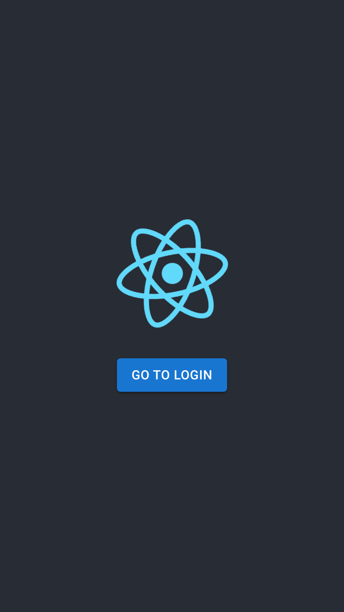
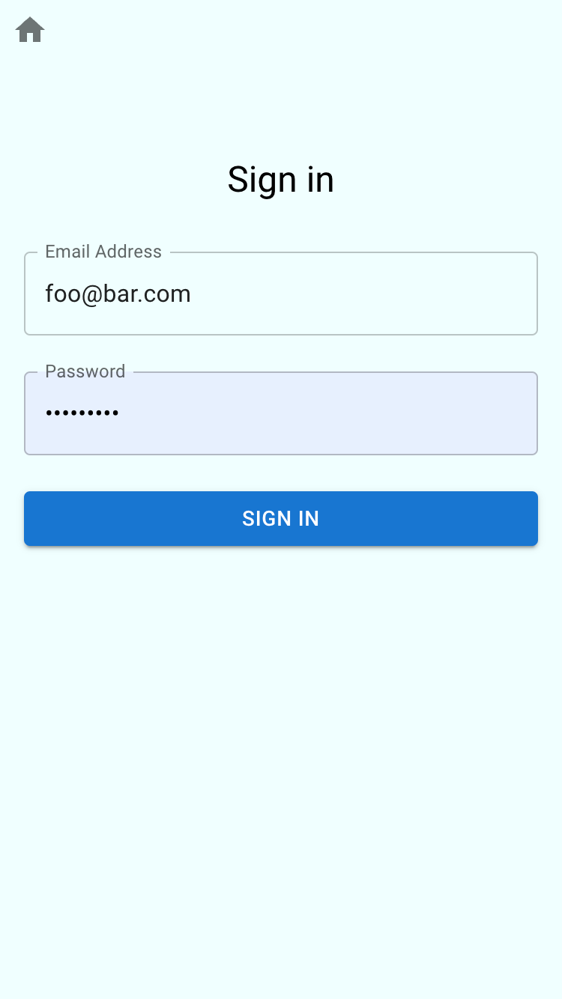

# Overview

This project was bootstrapped with [Create React App](https://github.com/facebook/create-react-app).

```
npx create-react-app simple-reactjs-example --template typescript
```

MaterialUI, react-hook-form, react-router-dom are additional dependencies added. 2 simple pages are rendered.

- `/` route points to home page with a button to navigate to Login page
- `/login` route points to login form with a link at the top header to navigate to Home page
<p align="center">

 
</p>

## Available Scripts

In the project directory, you can run:

### `npm start`

Runs the app in the development mode.\
Open [http://localhost:3000](http://localhost:3000) to view it in the browser.

The page will reload if you make edits.\
You will also see any lint errors in the console.

### `npm run build`

Builds the app for production to the `build` folder.\
It correctly bundles React in production mode and optimizes the build for the best performance.

The build is minified and the filenames include the hashes.\
Your app is ready to be deployed!

See the section about [deployment](https://facebook.github.io/create-react-app/docs/deployment) for more information.
